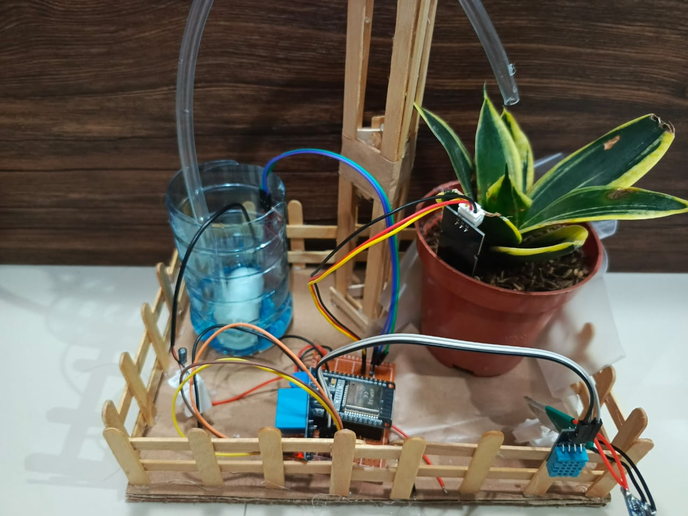
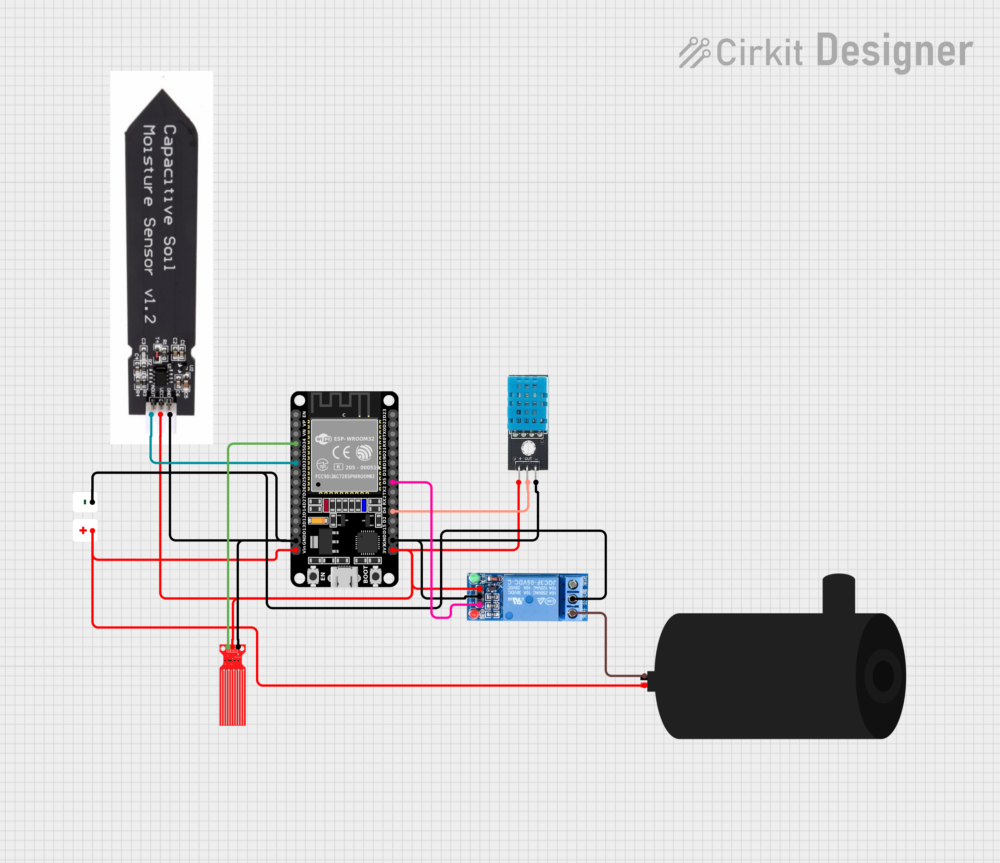

# 🌱 ESP32 Smart Gardening – Plant Oriented Thinking System (POTS)

### Overview

Plant Oriented Thinking System (POTS) is a smart IoT-based gardening automation system that helps monitor and maintain plants efficiently.  
It uses the ESP32 microcontroller, soil moisture sensor, and light sensor to collect environmental data.  
When soil moisture drops below a threshold, the system automatically activates a water pump to irrigate plants.  
All data can be accessed in real-time via Wi-Fi.

---

### ✨ Features
- 🌍 **Real-time monitoring** of soil moisture, humidity and temperature.  
- 💧 **Remote irrigation** system using water pump when the button on dashboard is clicked.  
- 📶 **Wi-Fi connectivity** for remote access and monitoring.

---

### 🛠 Components Required
- ESP32 DevKit V1
- Capacitive Soil Moisture Sensor (recommended over resistive)  
- Humidity & Temperature Sensor DHT11
- Water Pump + Relay (Both 5 Volts)
- MT3608 Step Up Module
- (Optional) Water Level Sensor
- (Optional) Li-Ion / Li-Po Battery + TP4056 Charger

---

### 📐 System Diagram

(https://app.cirkitdesigner.com/project/3e17d283-c36b-4758-a19a-d7adb212ccc9)

1. Power
   - Positive (+) connect to Vin pin
   - Negative (-) connect to GND pin
2. Moisture Sensor
   - Positive (+) connect to 3V3 pin
   - Negative (-) connect to GND pin
   - Data pin connect to pin 32
3. DHT11 Sensor
   - Positive (+) connect to 3V3 pin
   - Negative (-) connect to GND pin
   - Data pin connect to pin 4
4. Water Level Sensor
   - Positive (+) connect to 3V3 pin
   - Negative (-) connect to GND pin
   - Data pin connect to pin 34
5. Relay & Pump
   - Positive (+) connect to 3V3 pin
   - Negative (-) connect to GND pin
   - Data / input pin connect to pin 5
   - Pump positive (+) connect to power positive (+)
   - Pump negative (-) connect to relay NO pin
   - Relay Common pin connect to power negative (-)

---

